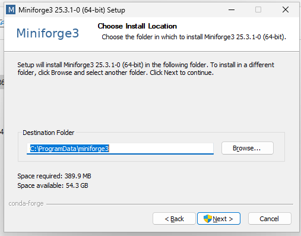
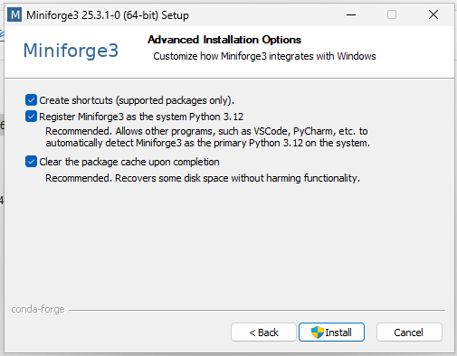
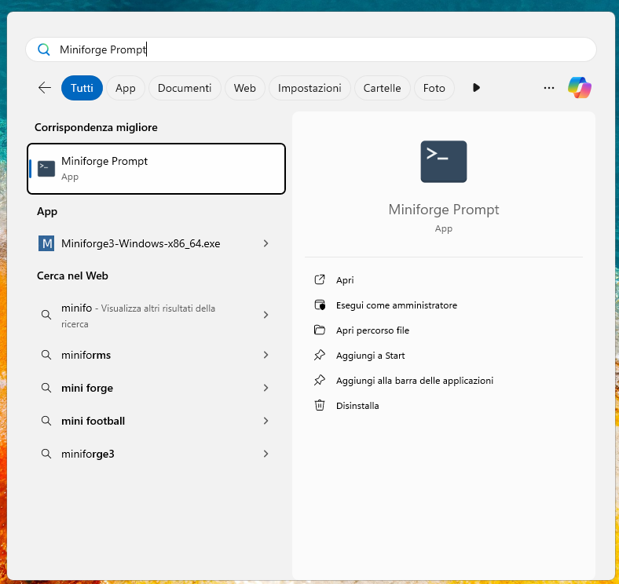
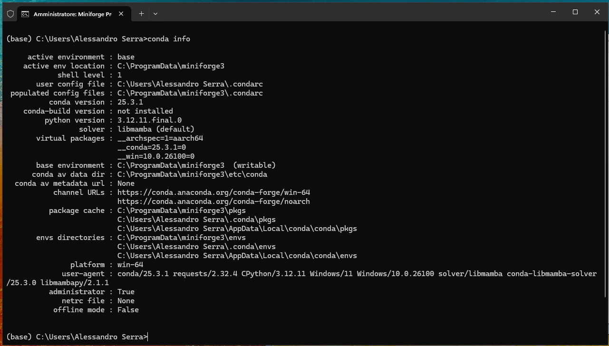

# Setup Ambiente Python

**Autore:** Alessandro Serra  
**Data:** _13 ottobre 2025_

---

## Indice

1. [Ambiente e Compilatore Python](#ambiente-e-compilatore-python)
   - [Perché Miniforge?](#perche-miniforge)
2. [Installazione](#installazione)
   - [Windows](#windows)
   - [MacOS / Linux / WSL](#macos-linux--wsl)

---

# Ambiente e Compilatore Python

Quando si lavora con Python, è comune utilizzare un ambiente di sviluppo. Un ambiente di sviluppo fornisce uno spazio isolato per scrivere, testare e eseguire codice Python. Esistono diverse opzioni disponibili per creare un ambiente di sviluppo Python.

Per la durata di questo corso useremo una nuova distribuzione di Anaconda chiamata **Miniforge**, una distribuzione open-source di Python che include una vasta gamma di librerie scientifiche e strumenti di gestione degli ambienti. È particolarmente utile grazie alla sua vasta selezione di pacchetti e alla sua gestione semplificata delle dipendenze.

## Perché Miniforge?

Utilizzare questo software permette a tutti di avere versioni aggiornate dei pacchetti che utilizzeremo, ma soprattutto, consente di avere le stesse versioni, in modo tale da non avere codici che funzionano in un computer ma in un altro no.

L'uso di questo software NON è obbligatorio ma **fortemente** consigliato, in quanto, se mai avrete bisogno di aiuto con i vostri codici, non ci si debba preoccupare della versione dei pacchetti che state utilizzando nella vostra macchina.

---

# Installazione

Noi utilizzeremo una versione di Anaconda chiamata **Miniforge**. Di seguito distingueremo i processi di installazione a seconda del sistema operativo del vostro PC.

## Windows

Per installare Miniconda su Windows è necessario seguire i seguenti passaggi:

1. Scaricare l'ultima versione del file eseguibile al link [<u>Miniforge.exe</u>](https://github.com/conda-forge/miniforge/releases/latest/download/Miniforge3-Windows-x86_64.exe);

2. Clicca due volte sul file appena scaricato;
3. Seguendo le istruzioni sullo schermo clicca "next", accetta la licenza e installa per "All Users" (in seguito il programma chiederà la password di amministratore del pc);

4. Lascia il percorso di installazione predefinito, dovresti vedere una schermata del tipo:

<p align="center">
  
  <br>
  <em>Percorso di installazione.</em>
</p>

5. <u>**IMPORTANTE**</u>: assicurati che queste opzioni siano **TUTTE** spuntate:

<p align="center">
  
  <br>
  <em>Opzioni di Installazione.</em>
</p>

6. Una volta finita l'installazione apri il menù start e nella barra di ricerca digita "Miniforge Prompt"

<p align="center">
  
  <br>
  <em>Prompt di Miniforge.</em>
</p>

7. Clicca sull'applicazione, una volta aperta dovrebbe sembrare una sorta di "terminale". Verifica la corretta installazione scrivendo

   ```bash
   conda info
   ```

   e premendo invio, dovrebbe apparire una lista simile a quella in figura

<p align="center">
  
  <br>
  <em>Risultato del comando scritto sopra.</em>
</p>

Complimenti, avete installato Miniforge con successo!

---

## MacOS, Linux & WSL

Per installare Miniforge su sistemi operativi UNIX-like (MacOS, Linux o WSL) è necessario seguire i seguenti passaggi:

1. Aprire una finestra di terminale (su MacOS aprite Spotlight con Command + Spazio e digitate "Terminale") e eseguite il comando:

   ```bash
   curl -L -O "https://github.com/conda-forge/miniforge/
   releases/latest/download/Miniforge3-$(uname)-$(uname -m).sh"
   ```

2. Una volta che il comando finisce, eseguite anche il seguente

   ```bash
   bash Miniforge3-$(uname)-$(uname -m).sh
   ```

3. Cliccate Invio scorrendo tutta la licenza:

   <p align="center">
     
     <br>
     <em>Schermata licenza.</em>
   </p>

   e una volta arrivati alla fine scrivete "yes" e cliccate nuovamente invio per dare inizio all'installazione (potrebbe essere richiesta la password del vostro account);

   <p align="center">
     
     <br>
     <em>Accettate la licenza.</em>
   </p>

4. Appena compare la richiesta di dove installare il programma cliccate Invio senza modificare nulla

   <p align="center">
     
     <br>
     <em>Percorso di Installazione.</em>
   </p>

5. In ultima battuta, ad installazione completata, inserite "yes" e premete Invio quando il programma chiede se inizializzare Conda per la Shell corrente:

   <p align="center">
     
     <br>
     <em>Inizializzare Conda per la Shell corrente.</em>
   </p>

Complimenti, avete installato Miniforge con successo!

---

# Editor di Testo

L’editor di testo consigliato è **Visual Studio Code**, editor molto potente ma estremamente leggero. Per installare VSCode andate nella pagina di installazione al link [VSCode Downlaod](https://code.visualstudio.com/download) e scegliete la versione in base al vostro sistema operativo.

## Windows

Eseguite l'installazione, su Windows comparirà una finestra di installazione, accettate le condizioni e cliccate "avanti" sino a che non vi appare questa schermata:

<p align="center">
  
  <br>
  <em>Opzioni da selezionare per VSCode</em>
</p>

Selezionate le opzioni segnate ed andate avanti sino alla fine dell'installazione senza cambiare altro.

## MacOS

Per utenti Mac l'installazione non richiede la modifica o la spunta di alcuna casella, cliccate avanti per tutte le finestre e installate il software.\\

Una volta installato l'applicazione sarà ubicata nella cartella "Download", trascinatela in quella delle "Applicazioni" in modo che compaia nella schermata delle applicazioni.

## Linux

Una volta scaricato il file di installazione aprite una finestra di terminale e navigate sino alla directory "Download" (o "Scaricati" se la lingua di sistema è Italiano) con

```bash
cd ~/Download
```

Una volta nella directory "Download" utilizzate il comando "ls", dovreste vedere un file con una dicitura simile a _code_1.87.0-1709078641_amd64.deb_.

successivamente dovremmo estrarre il file eseguibile con il comando

```bash
sudo dpkg -i nome-file
```

Inserite la password del vostro utente ed il gioco è fatto.

---

# Setup di VSCode

Una volta completata l'intallazione create una cartella nella quale salverete i codici, aprite VSCode e con Control-O (Command-O per MacOS) navigate sino alla cartella precedentemente creata e apritela.

A questo punto create un file di testo con il pulsante in figura, dategli il nome che volete ma deve finire con l'estensione ".py"

<p align="center">
  
  <br>
  <em>Creazione file Python</em>
</p>

Comparirà un popup che vi chiede di installare gli strumenti e le estensioni per il linguaggio Python, fatelo.

Una volta fatto cliccate "Seleziona Interprete" in basso a destra come in figura:

<p align="center">
  
  <br>
  <em>Selezionare Interprete.</em>
</p>

Vi apparirà una finestra in alto, scegliete l'opzione con "(base)" prima del nome:

<p align="center">
  
  <br>
  <em>Selezionare Interprete Pt.2.</em>
</p>

<u>**NB:** Per Linux e MacOS il percorso sarà diverso, l'importante è che ci siano la dicitura "(base)" a sinistra e "Conda" a destra.</u>

Il gioco è fatto, ora abbiamo Python settato nel sistema!
